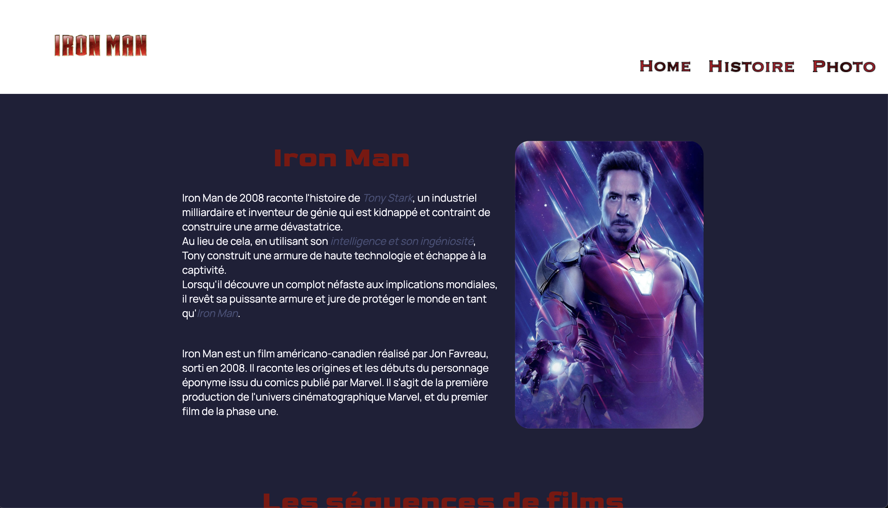
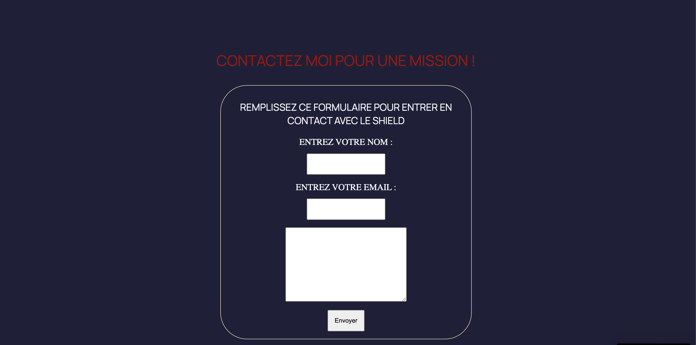
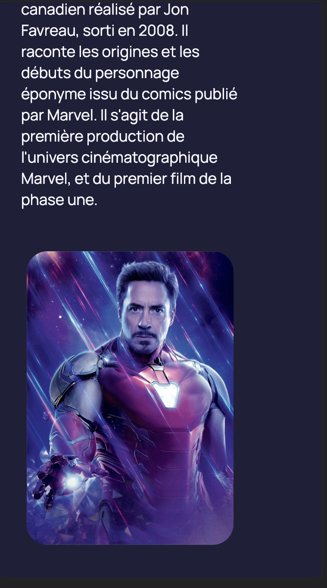

## Marvel Héro's

Version mobile
[Illustration du site web](./img/info2.png)
Technologie utilisée : 

1. Utilisation de la sémantique html de base.
2. Insertion de liens.
3. L'insertion image.
4. NavBar Graphique.
5. Respect des bonnes pratiques.

Les graphiques des polices ont été réalisés avec Inkscape.
Les re-dimensions de photos sont effectuées avec Gimp.

Les polices sont importés depuis Google Font.
La définition des valeur est en "em".

L'utilisation de flexbox et de Grid est utilisée pour le design.